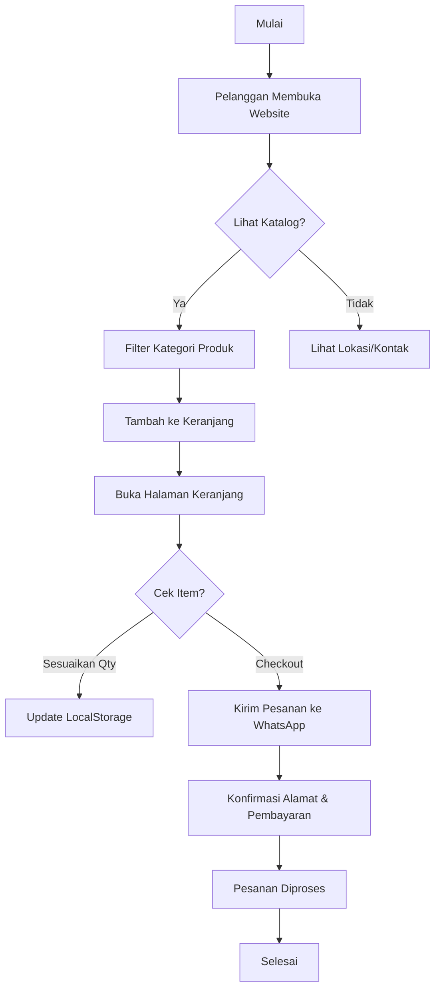

# Kananta Sayur Segar 🥦🥬


**Kananta Sayur Segar** adalah platform web modern untuk toko sayuran segar berkualitas yang berlokasi di Ngawi, Jawa Timur. Website ini dirancang untuk memberikan pengalaman berbelanja sayuran yang mudah, cepat, dan interaktif bagi pelanggan lokal.

## ✨ Fitur Utama

-   **Catalog Produk Dinamis**: Menampilkan berbagai kategori produk seperti Sayuran Segar, Sayur Ikat, Bumbu Rempah, dan Bahan Pokok.
-   **Sistem Keranjang Belanja**: Pelanggan dapat menambah, mengurangi, dan mengelola item belanja secara real-time.
-   **Checkout WhatsApp**: Integrasi langsung dengan WhatsApp memudahkan pelanggan untuk mengirimkan detail pesanan (nama barang, jumlah, total harga) secara otomatis ke admin toko.
-   **Desain Modern & Responsif**: Interface yang bersih dengan efek glassmorphism, animasi halus, dan sepenuhnya responsif di perangkat mobile maupun desktop.
-   **Informasi Lokasi Terintegrasi**: Peta Google Maps interaktif untuk memudahkan pelanggan menemukan lokasi toko fisik.
-   **SEO Optimized**: Menggunakan praktik terbaik SEO untuk visibilitas yang lebih baik di mesin pencari.

## 🛠️ Teknologi yang Digunakan

-   **Struktur**: [HTML5](https://developer.mozilla.org/en-US/docs/Web/HTML) (Semantik & SEO Friendly)
-   **Styling**: [Vanilla CSS3](https://developer.mozilla.org/en-US/docs/Web/CSS) (Custom Variables, Flexbox, CSS Grid)
-   **Logika**: [Vanilla JavaScript](https://developer.mozilla.org/en-US/docs/Web/JavaScript) (ES6+, LocalStorage API)
-   **Ikon**: [Font Awesome 6.4.0](https://fontawesome.com/)
-   **Fonts**: [Google Fonts (Poppins)](https://fonts.google.com/)

## 📂 Struktur Proyek

```text
kananta_sayur_segar/
├── index.html          # Halaman utama & catalog produk
├── cart.html           # Halaman keranjang belanja & detail pesanan
├── assets/
│   ├── css/
│   │   ├── style.css       # Styling utama & layout
│   │   ├── cart.css        # Styling khusus halaman keranjang
│   │   └── animations.css  # Definisi animasi scroll & transisi
│   ├── js/
│   │   └── script.js       # Logika produk, keranjang, & checkout
│   └── images/             # Folder aset gambar produk
└── .vscode/            # Konfigurasi workspace
```

## 🚀 Alur Kerja Aplikasi



## ⚙️ Cara Menjalankan Project

1.  **Clone atau Download** repositori ini ke komputer Anda.
2.  Pastikan semua folder (assets, images, dll.) berada dalam struktur yang benar.
3.  Buka file `index.html` menggunakan browser favorit Anda (Chrome, Edge, Firefox).
4.  *Rekomendasi*: Gunakan ekstensi **Live Server** di VS Code untuk pengalaman pengembangan yang lebih baik.

## 📱 Kontak Kami

-   **WhatsApp**: [+62 858-0684-4758](https://wa.me/6285806844758)
-   **Instagram**: [@kananta_sayursegar](https://instagram.com/kananta_sayursegar)
-   **Alamat**: Jalan Dokter Wahidin No.54, Ngadirejo, Ngawi, Jawa Timur 63218.

---

&copy; 2026 Kananta Sayur Segar. Dibuat dengan ❤️ untuk kesegaran keluarga Anda.
